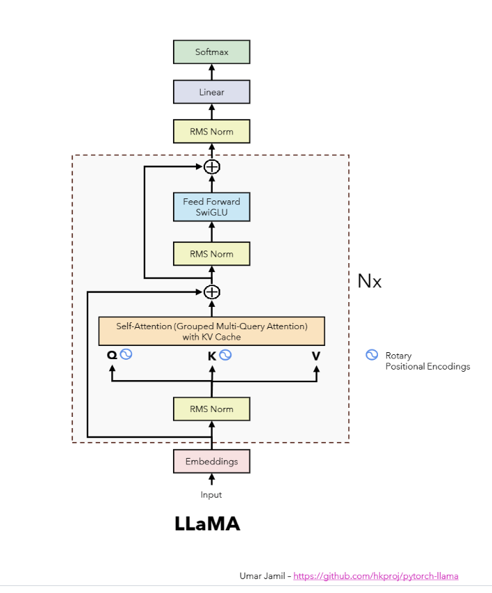

# **LLaMA**

### **Papers📄**  
I am reading these papers:  
☑️ [LLaMA: Open and Efficient Foundation Language Models](https://ai.meta.com/research/publications/llama-open-and-efficient-foundation-language-models/)  
☑️ [Llama 2: Open Foundation and Fine-Tuned Chat Models](https://ai.meta.com/research/publications/llama-2-open-foundation-and-fine-tuned-chat-models/)  
☑️ [OPT: Open Pre-trained Transformer Language Models](https://arxiv.org/abs/2205.01068)  
✅ [Attention Is All You Need](https://arxiv.org/abs/1706.03762)  
✅ [Root Mean Square Layer Normalization](https://arxiv.org/abs/1910.07467)  
✅ [GLU Variants Improve Transformer](https://arxiv.org/abs/2002.05202)  
☑️ [RoFormer: Enhanced Transformer with Rotary Position Embedding](https://arxiv.org/abs/2104.09864)  
✅ [Self-Attention with Relative Position Representations](https://arxiv.org/pdf/1803.02155.pdf)  
☑️ [BERT: Pre-training of Deep Bidirectional Transformers for Language Understanding](https://arxiv.org/abs/1810.04805)

### **Goals 🚀**
✅ Understand the concept of dot product of two matrices.   
✅ Understand the concept of autoregressive language models.  
✅ Understand the concept of attention computation.  
✅ Understand the workings of `Byte-Pair Encoding` (BPE) algorithm and tokenizer.   
✅ Read and implement the workings of the `SentencePiece` library and tokenizer.  
✅ Understand the concept of tokenization, input ids and embedding vectors.  
✅ Understand & implement the concept of positional encoding.  
✅ Understand the concept of single head self-attention.  
✅ Understand the concept of scaled dot-product attention.  
✅ Understand & implement the concept of multi-head attention.  
✅ Understand & implement the concept of layer normalization.  
✅ Understand the concept of masked multi-head attention & softmax layer.  
✅ Understand and implement the concept of RMSNorm and difference with LayerNorm.  
✅ Understand the concept of internal covariate shift.  
✅ Understand the concept and implementation of feed-forward network with ReLU activation.  
✅ Understand the concept and implementation of feed-forward network with SwiGLU activation.  
☑️ Understand the concept of absolute positional encoding.  
✅ Understand the concept of relative positional encoding.  
☑️ Understand and implement the rotary positional embedding.   
☑️ Understand and implement grouped query attention from scratch.  
☑️ Understand and implement the concept of KV cache.   
☑️ Adding ...

### **Related GitHub Works:**
🌐 [pytorch-llama](https://github.com/hkproj/pytorch-llama/tree/main) - PyTorch implementation of LLaMA by Umar Jamil.  
🌐 [pytorch-transformer](https://github.com/hkproj/pytorch-transformer/tree/main) - PyTorch implementation of Transformer by Umar Jamil.  
🌐 [llama](https://github.com/facebookresearch/llama) - Facebook's LLaMA implementation.  
🌐 [tensor2tensor](https://github.com/tensorflow/tensor2tensor) - Google's transformer implementation.  
🌐 [rmsnorm](https://github.com/bzhangGo/rmsnorm) - RMSNorm implementation.  
🌐 [roformer](https://github.com/ZhuiyiTechnology/roformer) - Rotary Tranformer implementation.

### **Articles:**
✅ [Understanding SentencePiece ([Under][Standing][_Sentence][Piece])](https://colabdoge.medium.com/understanding-sentencepiece-under-standing-sentence-piece-ac8da59f6b08)  
✅ [SwiGLU: GLU Variants Improve Transformer (2020)](https://kikaben.com/swiglu-2020/#:~:text=The%20FFN%20with%20GELU%20activation%20becomes%3A%20FFN%20GELU,cumulative%20distribution%20function%20of%20the%20standard%20normal%20distribution.)